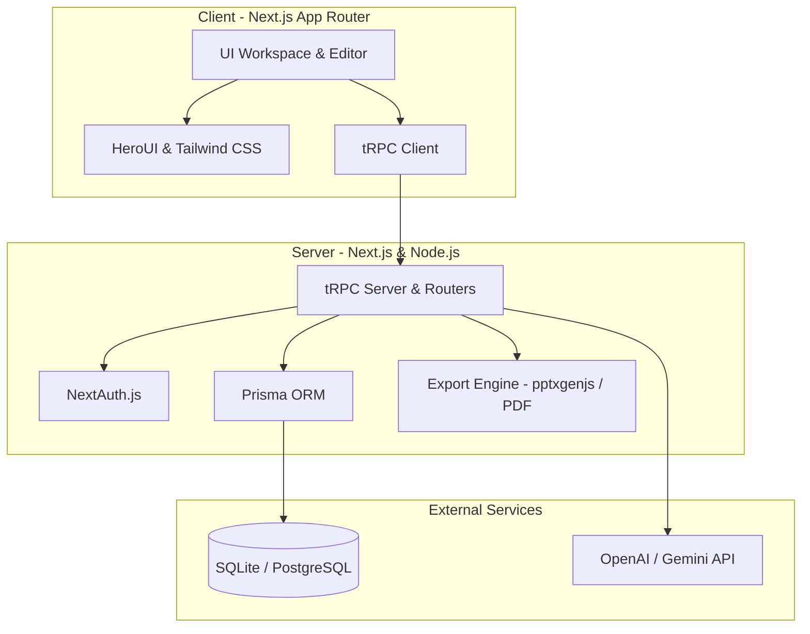
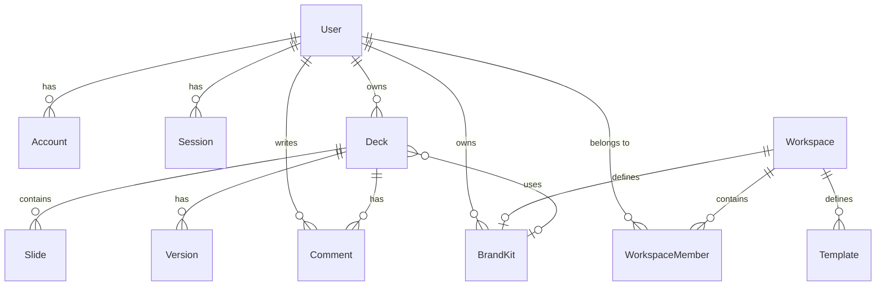

# GenStack AI — System Design Specification

This document details the system design, database schema, API architecture, and AI orchestration pipelines for **GenStack AI**, a production-grade AI-powered presentation workspace that transforms text prompts, notes, PDFs, or URLs into professional, export-ready slide decks.

---

## 1. High-Level Architecture

GenStack AI uses a decoupled, type-safe stack optimized for fast rendering, rich interactive editing, and reliable asynchronous generation:



---

## 2. Core Database Schema

The SQLite/PostgreSQL schema is managed via Prisma. Relationships enforce cascade deletes where applicable to ensure data hygiene.



### 2.1 Database Models (Prisma Reference)

*   **User & Authentication**: Integrated with NextAuth adapter rules (`User`, `Account`, `Session`, `VerificationToken`).
*   **Workspace**: Groups members and enforces access control lists.
*   **Deck**: Represents a presentation. Linked to slides, version snapshots, and brand kits.
*   **Slide**: Individual slides. Content is serialized as JSON for layout flexibility. Enforces spatial order and lock states.
*   **BrandKit**: Color tokens (primary, secondary, accent, background, text) and typography styles applied to decks.
*   **Template**: Pre-defined layout categories (e.g. startup, HR, report).
*   **Version**: Slide snapshots for history rollback.

---

## 3. API Router Design (tRPC)

API interactions are managed through a unified tRPC API Router `src/server/routers/_app.ts` split into routers.

### 3.1 Deck Router (`deckRouter`)
*   **`list`** (Protected): Fetch all decks owned by the authenticated user.
*   **`getById`** (Protected): Fetch a deck with its slides and brand kit.
*   **`create`** (Protected): Create a new blank deck with metadata.
*   **`generateOutline`** (Protected): Run AI to generate an outline and create slides.
*   **`regenerateSlide`** (Protected): Regenerate a single unlocked slide with AI.
*   **`export`** (Protected): Generate and return base64 PPTX representation of a deck.

### 3.2 Brand Kit Router (`brandKitRouter`)
*   **`list`** (Protected): List user brand kits.
*   **`create`** (Protected): Create a new Brand Kit with default theme colors.

---

## 4. AI Orchestration Pipeline

```
┌──────────────┐      ┌───────────────────┐      ┌─────────────┐      ┌────────────────┐
│  Raw Input   │ ───> │ Outline Generator │ ───> │ Slide Gen   │ ───> │ Export Engine  │
│  (Prompt,    │      │ (Objective, Title,│      │ (Layout,    │      │ (pptxgenjs,    │
│  Notes, PDF) │      │ Outline Structure)│      │ Bullet JSON)│      │ Node Buffer)   │
└──────────────┘      └───────────────────┘      └─────────────┘      └────────────────┘
```

1.  **Intake Parsing**: Extracts key topics, target audience, and duration from prompt/notes.
2.  **Outline Generator**: Generates a structured sequence of slides (usually 8–15 slides) containing titles, suggested layouts, and visual concepts.
3.  **Slide Generation**: Generates concise headlines, bullet points (formatted in JSON), and speaker notes for each slide.
4.  **Style & Apply**: Synthesizes the Brand Kit color tokens and typography onto the generated slides.

---

## 5. Technology Stack & Packages

*   **Framework**: Next.js 15 (App Router, React 19, TypeScript 5)
*   **Database ORM**: Prisma Client (v6.19)
*   **API Protocol**: tRPC (v11) & React Query
*   **Styling**: Tailwind CSS & HeroUI (UI primitives)
*   **Export**: `pptxgenjs` (High-fidelity PowerPoint generation)
*   **AI Integration**: OpenAI SDK (`openai`)
